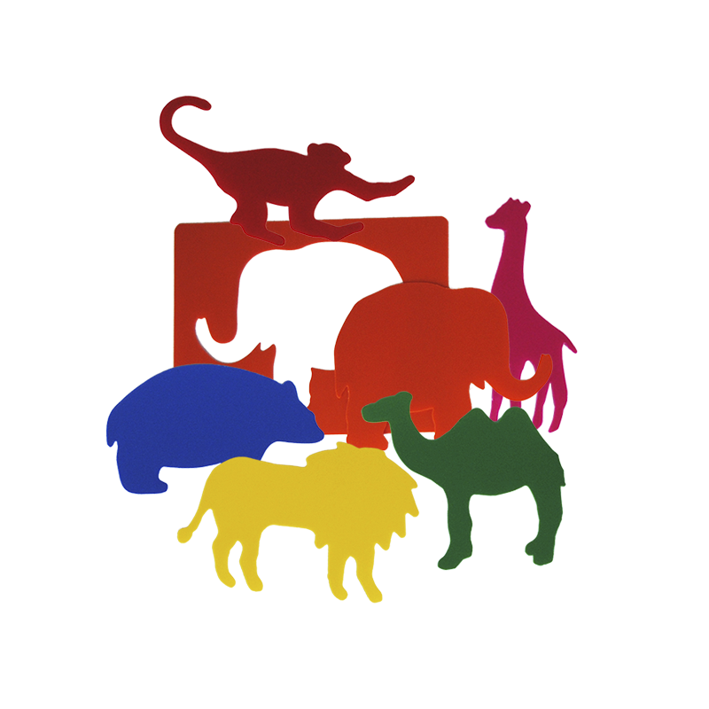

# DevSecOps demo

**DevSecOps** automates the integration of security at every phase of the software development lifecycle, from initial design through integration, testing, deployment, and software delivery.

This demo is an example of Maven project with security and quality code pipelines, based on zoo records (animals and environments).

## Requirements

- Java 11
- Maven (v3.5.4 recommended)

## Quick start

Compile this project using:

> mvn clean install

Then you can run it using:

> mvn spring-boot:run

The demo should be deployed in ***localhost:8080***.

## Use

Several API endpoints are available to test this demo. This operations are defined in Swagger (http://localhost:8080/swagger-ui.html), and explained in the following lines.

### GET:

- /demo/author: the demo author
- /demo/description: motivation of this project
- /demo/animals: lists all animals in the zoo
- /demo/environments: lists all zoo environments

### POST:

- /demo/animal: create a new animal in the zoo
- /demo/animal/{id}: update an animal registry
- /demo/environment: create a new animal environment in the zoo
- /demo/environment/{id}: update an environment  

### DELETE:

- /demo/animal/{id}: delete an animal registry
- /demo/environment/{id}: delete an environment 

